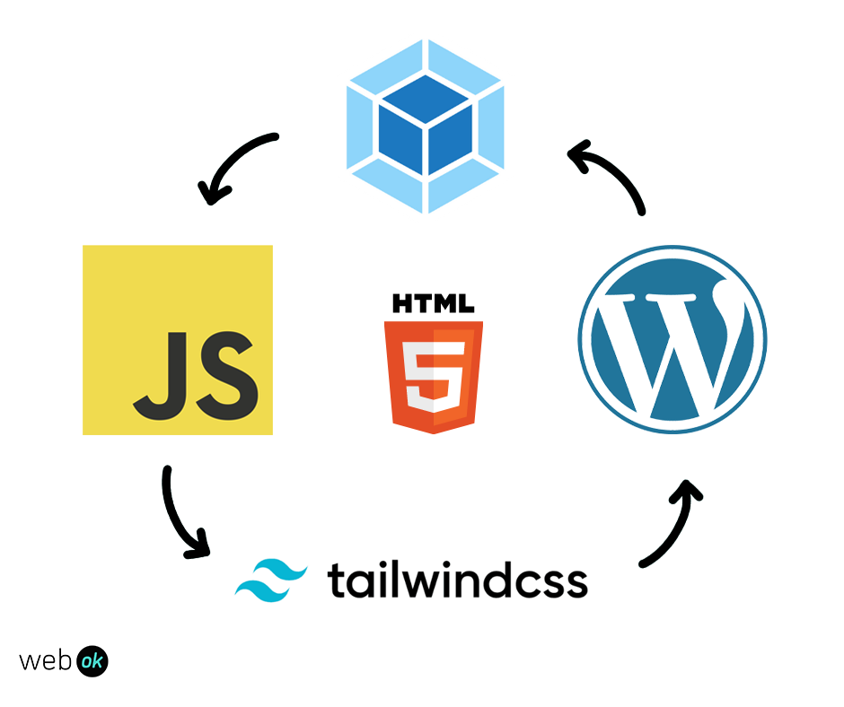

# JS Webpack Tailwind WordPress Theme Starter

<div>
  
</div>

## Usage
Clone the repository in your local machine. 
Run the following command to install the dependencies
```bash
npm install
```

Then run the following command to start the dev server:
```bash
npm start
```

## Build
To generate the production build, run the following command:
```bash
npm run build
```

# License
[MIT](LICENSE)# reeldeal
